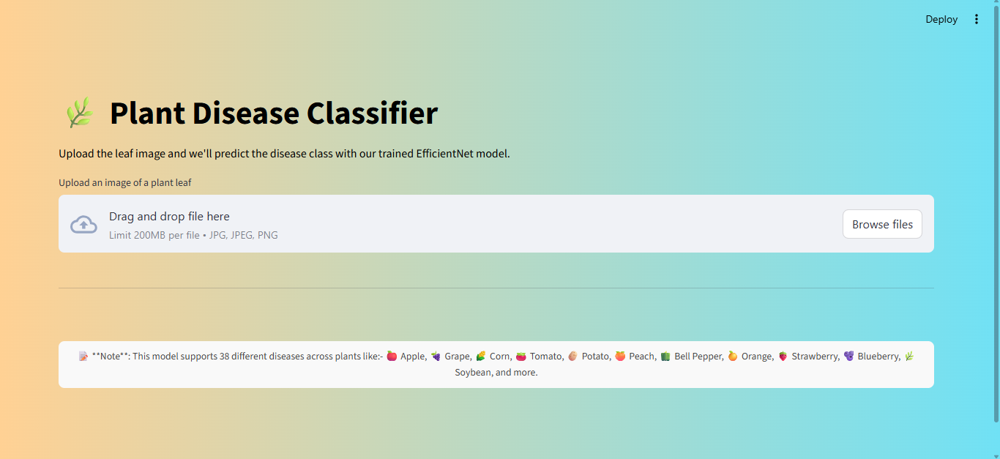
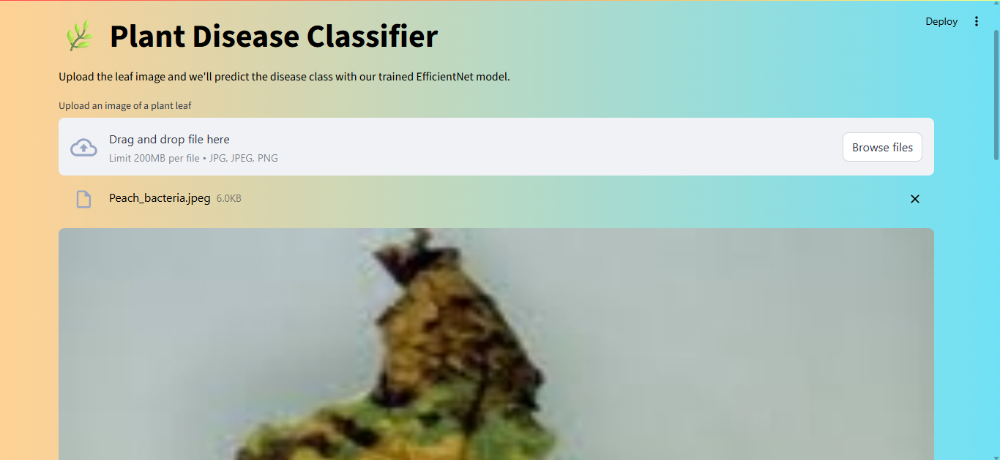
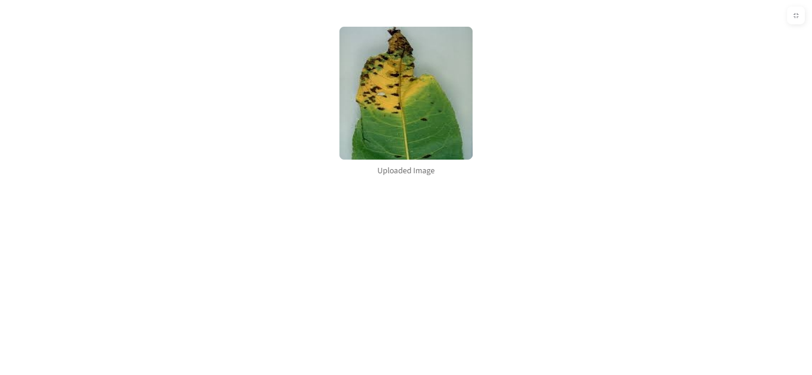
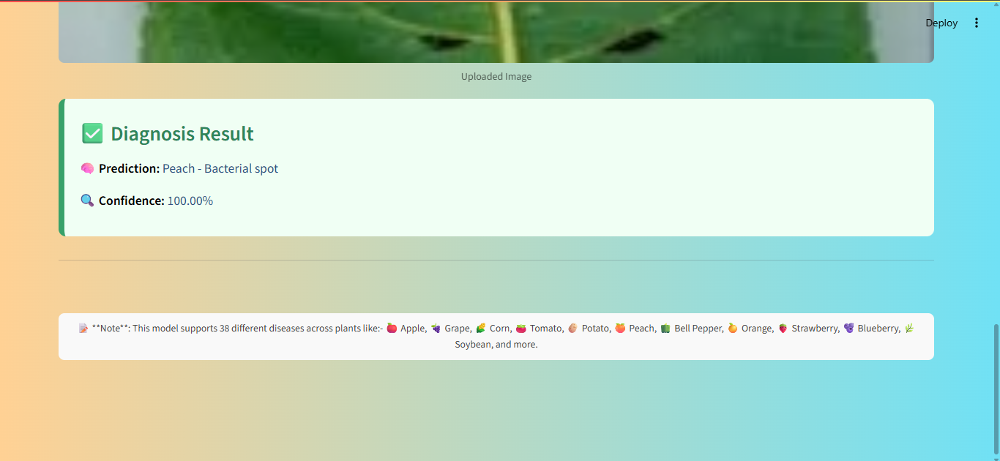

# 🍃 Plant Disease Detection Web App

This project is an AI-powered web application that identifies plant diseases from leaf images using deep learning (EfficientNetB0). Built with TensorFlow and Streamlit, it’s fast, accurate, and beautifully designed.

---

## 🚀 Features

- 📸 Upload a plant leaf image
- 🔍 Get disease prediction and confidence score
- 🧠 Trained on 38 plant disease classes
- ⚙️ EfficientNetB0 with fine-tuning
- 🎨 Elegant gradient background and modern UI
- 💾 Model auto-loaded at startup

---

## 🌐 Live Demo

Check out the deployed app 👉  
🌐 [Plant Disease Prediction App – Streamlit](https://stock-forecasting-app-vcfos2fekk2flfywnkzcfn-parthmendiratta.streamlit.app/)

---

### 📸 Screenshots

#### 🌿 Full Interface


#### 🖼️ Uploaded Image Preview


#### ✅ Diagnosis Result


#### 📌 Footer Note



---

## 🗂️ Project Structure

```
plant_disease_app/
│
├── app.py                # 🌐 Streamlit frontend
├── model.py              # 🔧 Model architecture (EfficientNetB0)
├── utils.py              # 🧼 Image preprocessing and decoding
├── requirements.txt      # 📦 Python dependencies
├── README.md             # 📘 This file
└── best_model.h5         # 🧠 Trained model (saved separately)
```

---

## 🧪 Model Info

- 📚 **Base Model**: EfficientNetB0 (transfer learning)
- 🔁 Fine-tuned top layers
- 🏷️ 38 disease categories (fruits, vegetables, etc.)
- 📊 Accuracy: ~95% on train / ~83% on val

---

## 🔧 How to Run

1. Clone the repo and place the model file:
   ```bash
   git clone https://github.com/parthmendiatta/plant_disease_app.git
   cd plant_disease_app
   ```

2. Place `best_model.h5` inside the project root.

3. Install dependencies:
   ```bash
   pip install -r requirements.txt
   ```

4. Run the app:
   ```bash
   streamlit run app.py
   ```

---

## ✅ Supported Plant Classes

This model detects diseases in the following crops:

- 🍎 Apple, 🍇 Grape, 🍅 Tomato, 🌽 Corn (Maize), 🥔 Potato  
- 🍊 Orange, 🍑 Peach, 🌶️ Bell Pepper, 🥒 Squash  
- 🍓 Strawberry, 🫐 Blueberry, 🍒 Cherry, 🫘 Soybean, 🌿 Raspberry

And many more — 38 in total!

---


## 📬 Contact

For questions or feedback, feel free to reach out:

- GitHub: [yourusername](https://github.com/parthmendiratta)

---

## 👨‍💻 Author

Developed with ❤️ by **[Parth Mendiratta](https://www.linkedin.com/in/parth-mendiratta-66aa48305?lipi=urn%3Ali%3Apage%3Ad_flagship3_profile_view_base_contact_details%3Bw4mOBgjQTmGySiPADkbxnA%3D%3D)**
